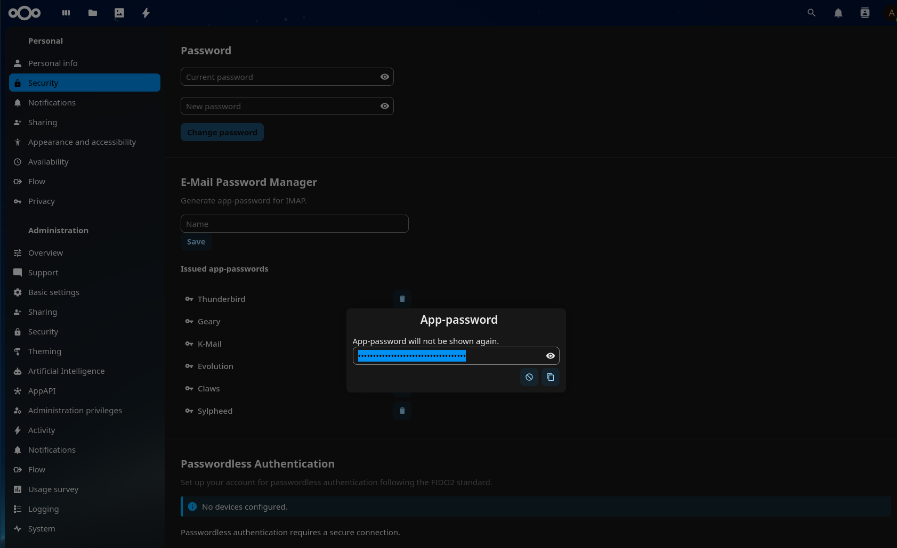

A database table of hashes and salts that dovecot can use to authenticate, with a slick web gui in Nextcloud

## ⚠️ Security: disable user-editable email

**When the Stalwart backend is enabled, you MUST prevent users from
changing their own email address.**

This app uses the Nextcloud user's email address as the Stalwart
principal identifier for app-password CRUD. A user who can change their
own email to another user's (or an admin's) address can read, add, or
delete that user's Stalwart app passwords.

### What to do

As admin, lock down the email field on the profile settings so regular
users cannot change it. Admins can still change user emails via the
user management UI or `occ user:setting <uid> settings email <value>`
— this is a privileged operation, and admins should know that changing
a user's email also moves that user's Stalwart mailbox identity.

For LDAP-backed deployments, ensure the email attribute is not
user-writable in the directory.
